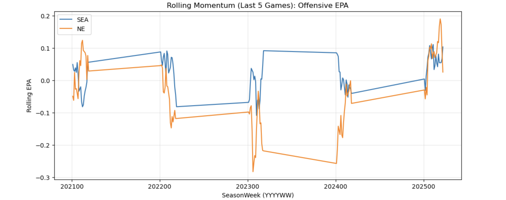

# NFL Super Bowl Winner Predictor (SEA vs NE)

Predicts the Super Bowl winner using NFL play-by-play data (2009–2025) with rolling 5-game momentum features and an XGBoost classifier.

## Data
- Source: nflverse via `nfl_data_py`
- Seasons: 2009–2025

## Feature Engineering
- Team-level game stats from play-by-play (points, EPA, success rate, turnovers)
- Rolling 5-game averages (momentum) with leakage prevention (shifted by 1 game)
- Matchup “difference” features (SEA - NE)

## Modeling
- XGBoost classifier for win probability
- Baseline: point differential probability model
- Final: blended probability

## Visuals



## How to Run
```bash
pip install -r requirements.txt